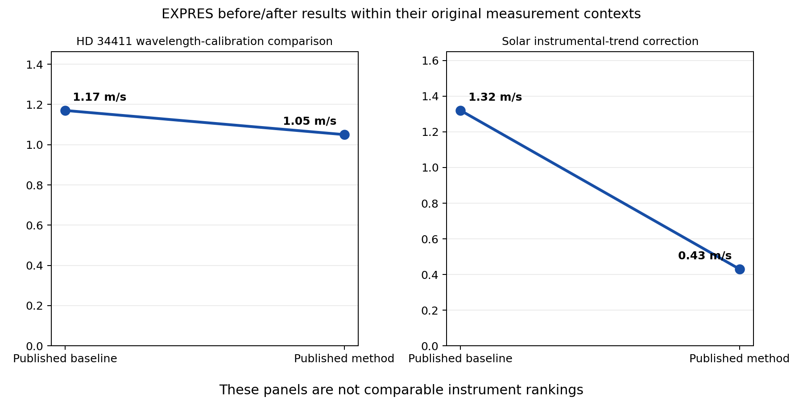

# Precision Radial-Velocity Spectrograph Reading Guide

[](https://github.com/Biswajit1999/eprv-spectrograph-landscape/actions/workflows/ci.yml)
[](LICENSE)

My source-linked reading guide to precision radial-velocity spectrographs: where
physical instruments are deployed, what their papers measure, their dated status,
which problems remain, and which bounded questions could support later analysis.

**Public website:** https://biswajit1999.github.io/eprv-spectrograph-landscape/

The repository does not calculate a “best instrument” score. Requirements,
calibration residuals, internal uncertainties, stellar RMS and planet-fit
residuals are different quantities. The data model keeps them separate.

## Contents

- **53 physical-instrument census records** across 33 represented facilities, with verified
  and partially verified rows visibly separated.
- **21 performance-core records** spanning operational, caveated, offline,
  commissioning, legacy and planned systems.
- **22 quantitative claim records**, each with a metric, sample, baseline,
  caveat, source and access date.
- A literature-based [scientific report](docs/REPORT.md), explicit
  [inclusion protocol](docs/METHODS.md) and [claim ledger](docs/CLAIMS.md).
- Four original figures generated only from committed CSV data.
- An accessible, filterable [research website](website/) with source-linked
  instrument profiles and nine extended challenge explainers.
- A selected [EXPRES reading note](docs/EXPRES_READING_NOTE.md) connecting 13
  selected primary papers to a clearly labelled future analysis question.
- A [HARPS reading note](docs/HARPS_READING_NOTE.md) following six technical
  sources through commissioning, wavelength calibration and the 2015/2026
  hardware-era boundaries.
- An [ESPRESSO reading note](docs/ESPRESSO_READING_NOTE.md) separating on-sky
  precision, absolute wavelength accuracy and science-light-path validation.
- [HARPS-N](docs/HARPS_N_READING_NOTE.md) and [NEID](docs/NEID_READING_NOTE.md)
  notes connecting solar data selection, calibration versions and testable
  signal-preservation questions.
- An [EXOhSPEC reading note](docs/EXOHSPEC_READING_NOTE.md) separating design
  targets, laboratory results, deployment history and conflicting current-status
  statements across seven selected sources.
- A tested Python package and command-line build.

The detailed performance core follows the instrument set in Burt, Dumusque & Halverson's
2026 review, with planned and regional additions clearly labelled. This is a
structured reading set, not a claim to enumerate every astronomical echelle or
every observing mode ever built. The broader directory is stored separately in
`data/census_registry.jsonl`; unresolved fields are part of each record rather
than hidden.

## Reproduce

```bash
python -m pip install -e ".[dev]"
pytest -q
eprv-landscape build --data data/instruments.csv --claims data/performance_claims.csv --out results
```

See [docs/REPRODUCIBILITY.md](docs/REPRODUCIBILITY.md) for a clean-environment
sequence and website instructions.

## Figures




The third figure is deliberately not a ranking: its bars describe different
experiments. Read each definition in `data/performance_claims.csv`.

## Scientific boundary

- No planet detection or occurrence-rate inference is performed.
- Design goals are never represented as achieved performance.
- Status is dated and kept separate from historical performance.
- No paper figure, observatory logo or substantial third-party text is copied.
- The project is independent and not endorsed by a listed facility or team.
- Future analysis questions are not completed research, publication claims, or
  statements about a facility's priorities.

Code is MIT licensed. Bibliographic metadata and factual specifications remain
attributed to their primary papers and official facility pages.
