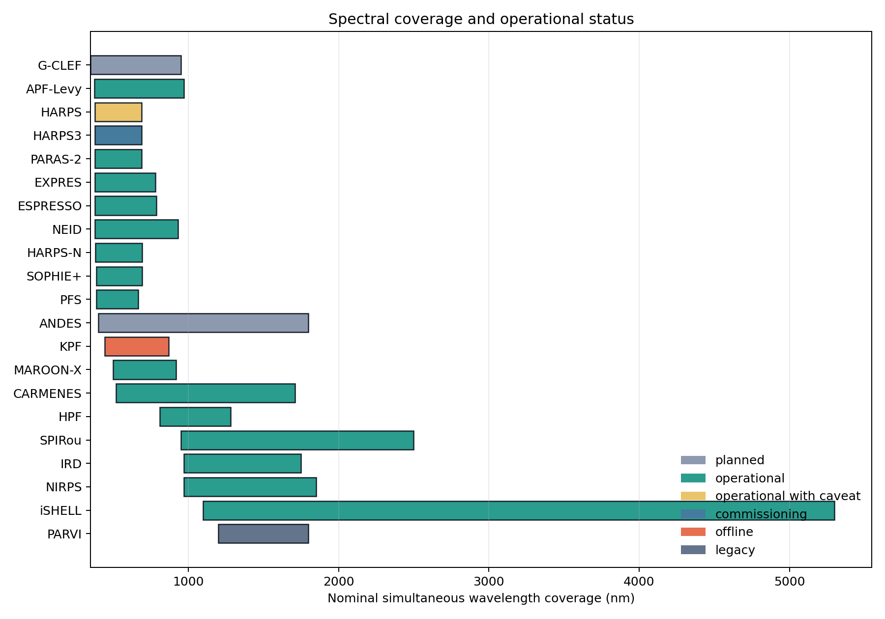
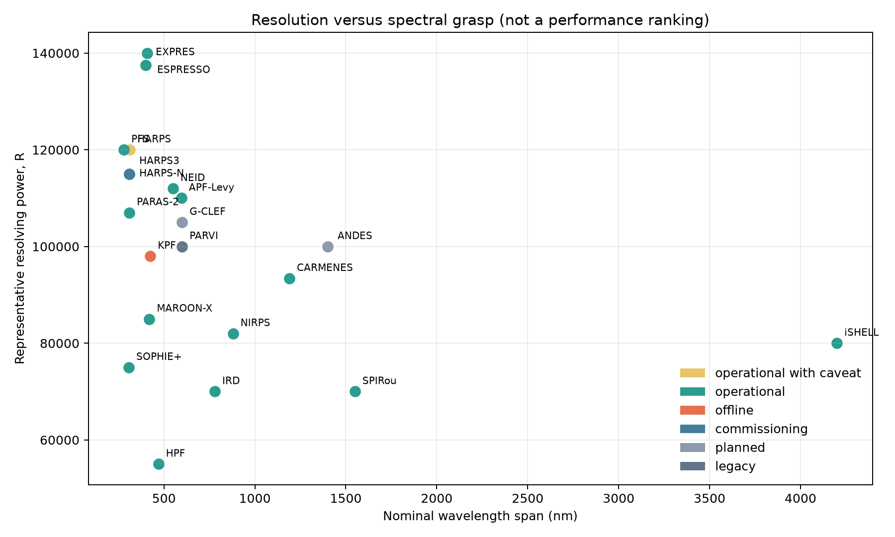
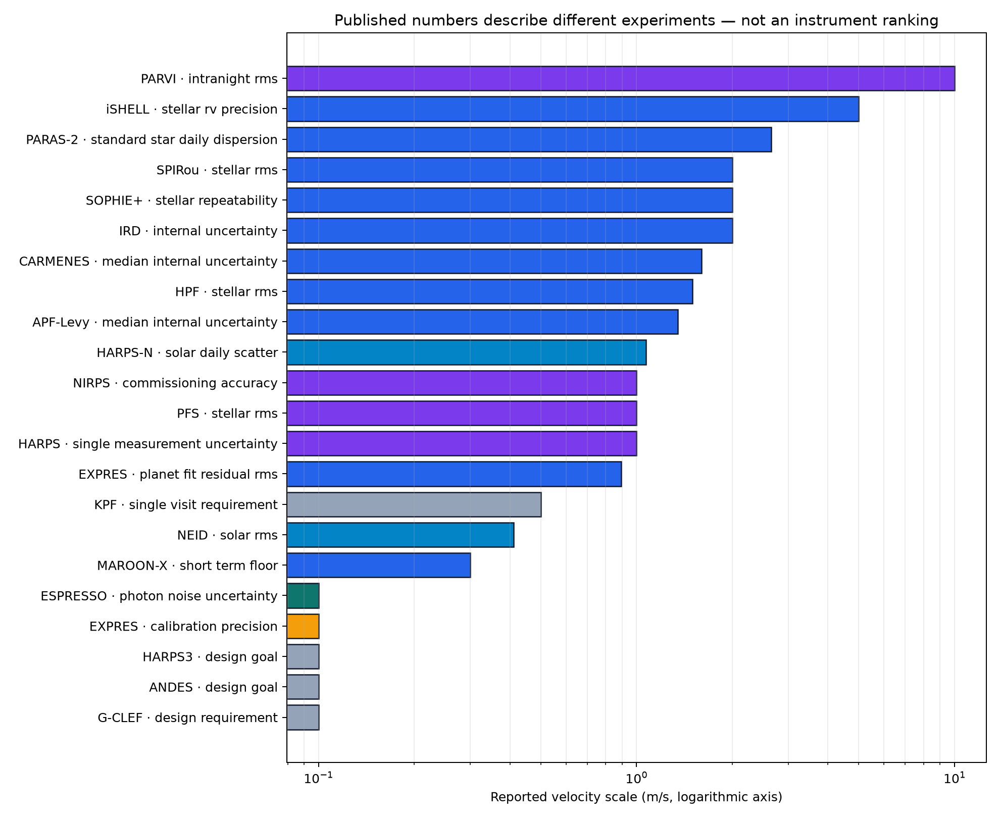

# Precision Radial-Velocity Spectrograph Landscape

[](https://github.com/Biswajit1999/eprv-spectrograph-landscape/actions/workflows/ci.yml)
[](LICENSE)

An independent, source-traceable study of precision radial-velocity
spectrographs: what published measurements establish, which systems are
operational as of **2 September 2026**, and which measurement problems remain.

The repository does not calculate a “best instrument” score. Requirements,
calibration residuals, internal uncertainties, stellar RMS and planet-fit
residuals are different quantities. The data model keeps them separate.

## Contents

- **21 instrument records** spanning operational, caveated, offline,
  commissioning, legacy and planned systems.
- **22 quantitative claim records**, each with a metric, sample, baseline,
  caveat, source and access date.
- A literature-based [scientific report](docs/REPORT.md), explicit
  [inclusion protocol](docs/METHODS.md) and [claim ledger](docs/CLAIMS.md).
- Three original figures generated only from committed CSV data.
- An accessible, filterable [research website](website/).
- A tested Python package and command-line build.

The detailed core follows the instrument set in Burt, Dumusque & Halverson's
2026 review, with planned and regional additions clearly labelled. This is a
curated evidence map, not a claim to enumerate every astronomical echelle or
every observing mode ever built.

## Reproduce

```bash
python -m pip install -e ".[dev]"
pytest -q
eprv-landscape build --data data/instruments.csv --claims data/performance_claims.csv --out results
```

See [docs/REPRODUCIBILITY.md](docs/REPRODUCIBILITY.md) for a clean-environment
sequence and website instructions.

## Figures







The third figure is deliberately not a ranking: its bars describe different
experiments. Read each definition in `data/performance_claims.csv`.

## Scientific boundary

- No planet detection or occurrence-rate inference is performed.
- Design goals are never represented as achieved performance.
- Status is dated and kept separate from historical performance.
- No paper figure, observatory logo or substantial third-party text is copied.
- The project is independent and not endorsed by a listed facility or team.

Code is MIT licensed. Bibliographic metadata and factual specifications remain
attributed to their primary papers and official facility pages.
