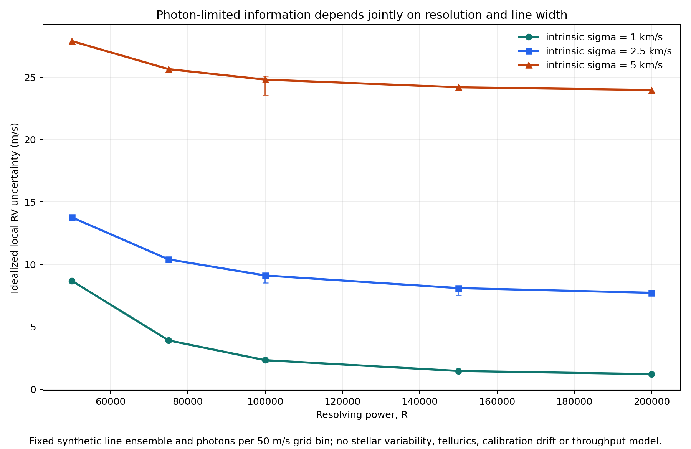

# Controlled Doppler-information experiment

## Research question

When photon budget, velocity sampling and absorption-line equivalent widths are
held fixed, how do resolving power and intrinsic line width jointly change the
local photon-limited radial-velocity information?

This is a controlled synthetic experiment, not an estimate of any listed
instrument's achieved precision. It isolates one mechanism that the literature
guide otherwise describes only qualitatively.

## Falsifiable hypothesis

The predeclared null hypothesis for this repository release is:

> For an intrinsic Gaussian line width of 5 km/s, increasing resolving power
> from 100,000 to 150,000 improves the local photon-limited RV uncertainty by
> less than 10% under the committed equal-photon experiment.

The alternative is an improvement of at least 10%. The threshold, scenarios
and deterministic seeds are stored in
`data/information_experiment_scenarios.csv`.

## Model

The experiment creates 36 deterministic absorption lines on a velocity grid
from -120 to +120 km/s in 0.05 km/s bins. Each line has a fixed equivalent
width. Its observed Gaussian width is

```text
sigma_observed^2 = sigma_intrinsic^2 + (c / (2.355 R))^2.
```

Line area is conserved as resolution changes. Every scenario receives 50,000
continuum photo-electrons per velocity bin. Therefore, the comparison changes
neither the line list nor the photon normalization.

For expected counts `mu_i` and velocity coordinate `v_i`, the local Fisher
information for a small Doppler shift is

```text
I_v = sum_i [(d mu_i / d v)^2 / (mu_i + read_noise^2)]
sigma_v = 1 / sqrt(I_v).
```

This is the velocity-coordinate form of the spectral-gradient weighting in
Bouchy, Pepe & Queloz (2001). The code evaluates the gradient numerically and
reports the Cramer-Rao lower bound. Four scenarios also receive 1,000 seeded
Poisson injection-recovery trials using a local one-step likelihood estimator.

## Results

The complete table is
`results/doppler_information_experiment.csv`; the build records its headline
tests in `results/manifest.json`.

| Intrinsic line sigma | R = 100,000 | R = 150,000 | Improvement |
|---:|---:|---:|---:|
| 1.0 km/s | 2.331 m/s | 1.466 m/s | 37.1% |
| 2.5 km/s | 9.115 m/s | 8.106 m/s | 11.1% |
| 5.0 km/s | 24.811 m/s | 24.195 m/s | 2.48% |

The broad-line null hypothesis is **not rejected**: the measured 2.48%
improvement is below the stated 10% threshold. The same resolution change is
material for narrow lines, showing that resolving power cannot be interpreted
without the astrophysical line-width regime.

Across the four Monte Carlo validation scenarios, empirical one-sigma error is
within approximately 2-4% of the Fisher prediction, and empirical one-sigma
coverage is 0.697-0.710. These checks support the numerical implementation in
the small-shift regime used here; they do not validate a real extraction
pipeline.



## Interpretation boundary

The absolute numbers are properties of this synthetic normalization. They
must not be compared with the heterogeneous published values elsewhere in the
repository. In particular, this experiment omits:

- wavelength-dependent stellar spectra and line blending beyond the synthetic
  ensemble;
- rotational kernels, macroturbulence and spectral-type dependence;
- throughput, detector sampling, blaze, readout strategy and wavelength range;
- tellurics, sky background, calibration error and line-spread-function drift;
- stellar activity and time-correlated noise;
- template mismatch and full nonlinear RV extraction.

The defensible result is the controlled interaction between line width and
resolution, not an instrument leaderboard or an achieved precision claim.

## Reproduction

```bash
python -m pip install -e ".[dev]"
eprv-landscape build --out results
pytest -q tests/test_doppler_information.py
```

The build regenerates both the CSV and figure from the committed scenario
table. The tests independently verify photon-count scaling, broadening order,
diminishing resolution gain, injection-recovery calibration and output schema.
